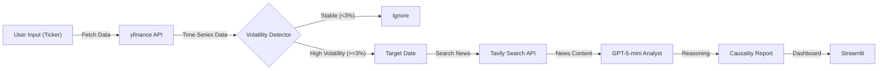

# AI Financial Sentiment Analyst (주가 변동 원인 분석기)

## 1. 프로젝트 개요
본 프로젝트는 단순히 주가 차트를 보여주는 것을 넘어, **"주가가 왜 움직였는가(Why)"**를 규명하는 **금융 AI 에이전트**입니다.

Yahoo Finance API를 통해 실시간 주가 데이터를 수집하여 변동성(Volatility)이 높은 날짜를 자동으로 탐지하고, 해당 시점의 뉴스 데이터를 크롤링하여 LLM(GPT-4o)이 주가 등락의 핵심 원인을 분석합니다. 이를 통해 투자자는 차트와 뉴스를 일일이 대조하는 수고 없이, 시장의 인맥과 흐름을 즉각적으로 파악할 수 있습니다.

### 핵심 가치
* **Data-Driven Insight:** 막연한 질문이 아닌, 실제 주가 데이터의 변동(Anomaly)에 기반한 분석 수행.
* **Causality Inference:** 정량적 데이터(수치)와 정성적 데이터(텍스트)를 결합하여 인과관계 추론.
* **Automated Research:** 급등락 발생 시점의 뉴스만을 선별적으로 검색하여 정보의 정확도 향상.

## 2. 시스템 아키텍처

본 시스템은 '데이터 수집 - 이상 감지 - 원인 분석'의 3단계 파이프라인으로 구성됩니다.


## 3. 기술 스택
* **Language**: Python 3.10+

* **LLM**: OpenAI gpt-5-mini

* **Financial Data**: yfinance (Real-time Stock Data)

* **Search Engine**: Tavily API (News Retrieval)

* **Data Processing**: Pandas (Time-series Analysis)

* **UI**: Streamlit

## 4. 주요 기능
### 4.1. 주가 변동성 자동 감지 (Anomaly Detection)
사용자가 종목 코드(Ticker)를 입력하면 최근 1개월간의 주가 데이터를 분석하여, 전일 대비 ±3% 이상 급격한 변동이 발생한 '이벤트 날짜'를 자동으로 필터링합니다.

### 4.2. 타겟 뉴스 검색 (Targeted News Retrieval)
단순한 최신 뉴스가 아니라, 변동이 감지된 **'그 날짜(Specific Date)'**의 뉴스만을 타겟팅하여 검색합니다. 이를 통해 노이즈를 줄이고 분석의 정확도를 높입니다.

### 4.3. 인과관계 요약 (Causal Analysis)
수집된 뉴스 기사들을 GPT-4o가 분석하여, 해당 날짜의 주가 상승/하락을 견인한 결정적 트리거(실적 발표, CEO 발언, 거시 경제 이슈 등)를 한 문장의 헤드라인 형태로 요약합니다.

## 5. 설치 및 실행 가이드
### 5.1. 환경 설정
저장소를 복제하고 필수 의존성 패키지를 설치합니다.

```bash
git clone [repository url]
pip install -r requirements.txt
```
### 5.2. 환경 변수 설정
프로젝트 루트 경로에 .env 파일을 생성합니다.

```Ini,ZTOML
OPENAI_API_KEY=sk-...
TAVILY_API_KEY=tvly-...
```


### 5.3. 실행
Streamlit 애플리케이션을 실행합니다.

```Bash
streamlit run main.py
```

### 실행 화면


